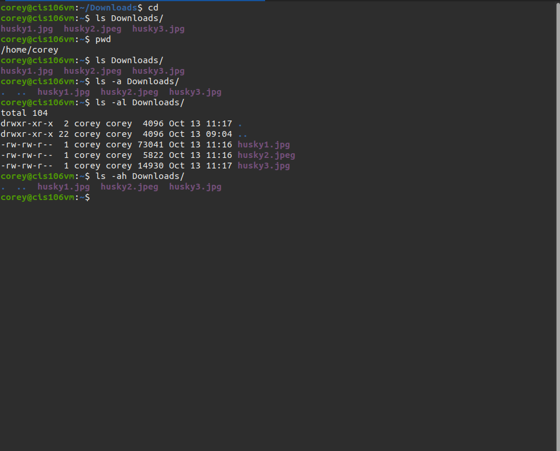

# Lab 3 | Installing software and navigating the file system | Answers
Assignment description [here](https://raw.githubusercontent.com/ra559/cis106/main/labs/lab3.md)

## Question 1
1. Which command did you use to search for the themes and to install them?
To search the theme i used the command 'apt search theme'.To install the theme i used 'sudo apt install yuyo-gtk-theme.
2. Which commands did you use to find and install the web browser?
   I used the command sudo apt-get install w3m w3m-img 
3.1 What is the name of the package?
Mate-icon-theme ubuntu-mate-icon-themes yuyo-gtk-theme.
3.2 What dependencies are needed in order to install the package? (you can either take a screenshot of the terminal or copy and paste from the terminal)w3m
mate-icon-theme ubuntu-mate-icon-themes
3.3 How much disk space will the package utilize after installation?
 14.3 MB disk space was used. 

## Question 2

## Question 3

## Question 4

## Question 5
